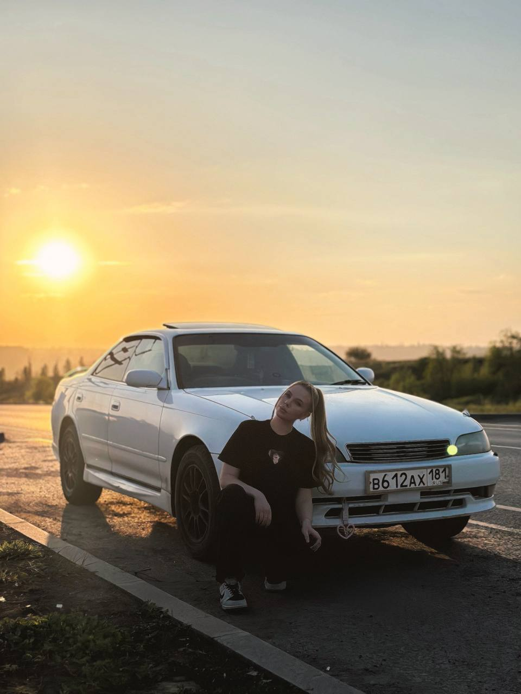
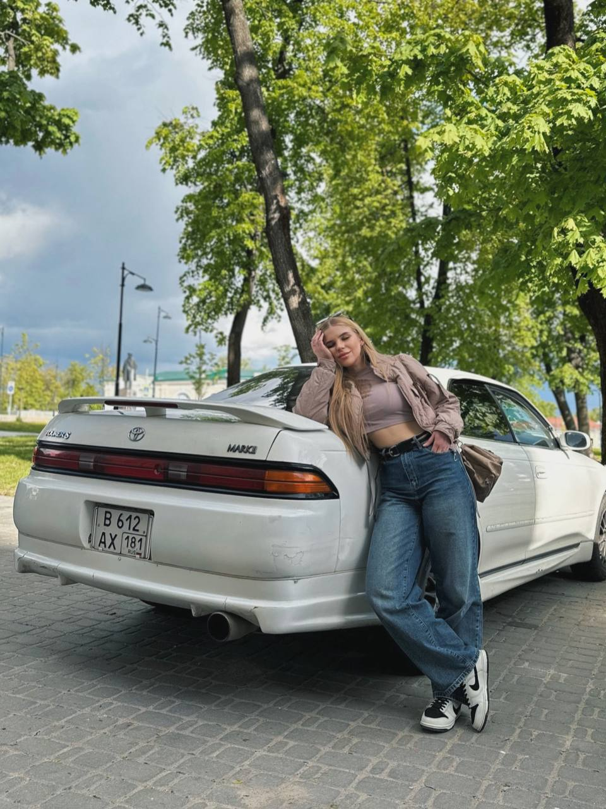
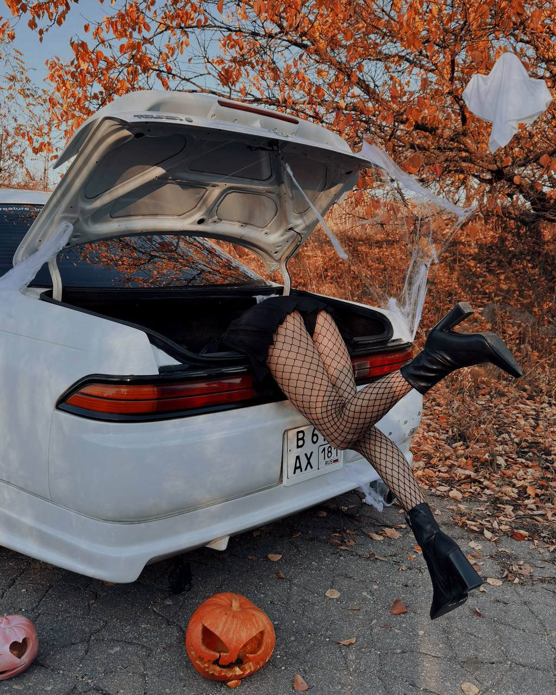
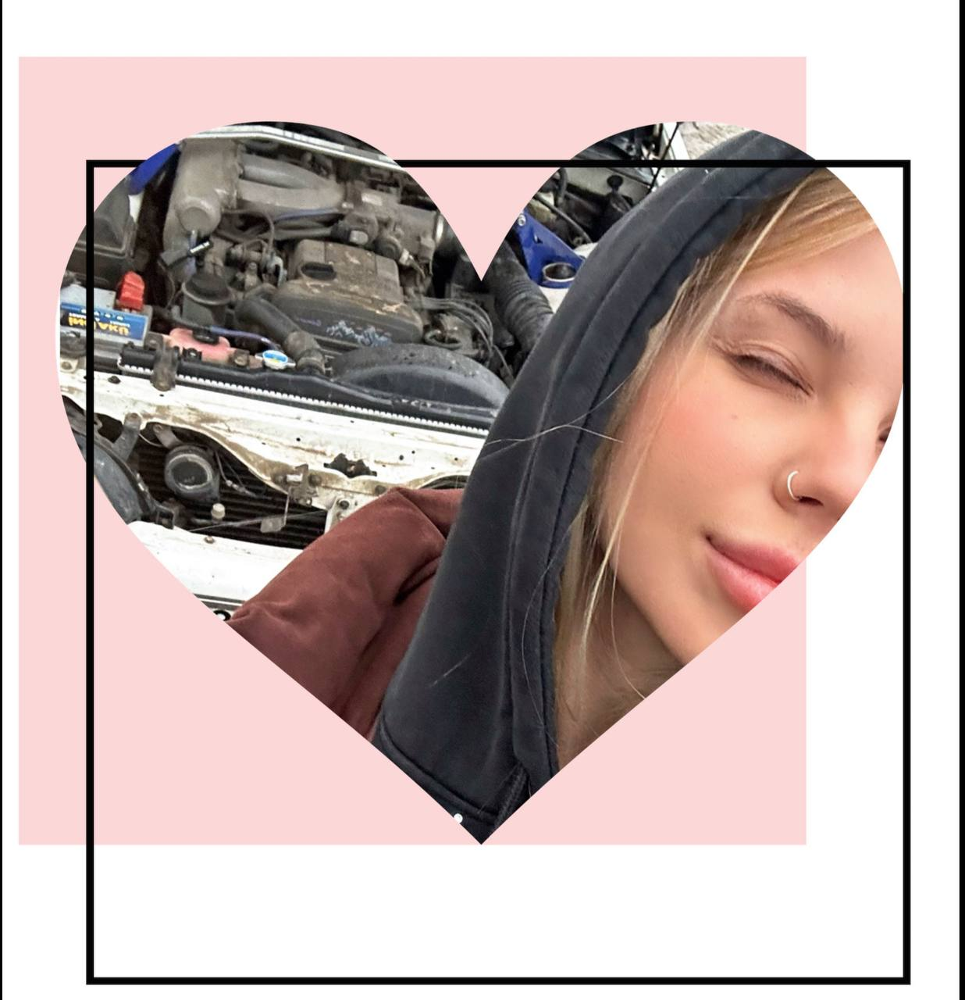

<!DOCTYPE html>
<html>
<head>
<meta charset="UTF-8">
<meta name="viewport" content="width=device-width, initial-scale=1.0">
<title>Для мамы ❤️</title>

</head>

<body>

<audio id="music" loop>
<source src="music.mp3" type="audio/mpeg">
</audio>

<h2>Поймай 8 сердечек 💖</h2>

0 / 8

<h1>С 8 Марта, мамочка 🌸</h1>

Мамочка, поздравляю тебя с 8 Марта! 🌸

Спасибо тебе за твою заботу, любовь и доброту.  
Ты самый близкий и дорогой человек для меня.  
Я очень благодарен тебе за всё, что ты делаешь каждый день.

Желаю тебе крепкого здоровья, счастья, радости и всегда хорошего настроения.  
Пусть у тебя всё получается, а каждый день будет наполнен улыбками, теплом и приятными моментами.

Я тебя очень люблю! ❤️

<b>С любовью, твой Самурай!</b>

</body>
</html>
